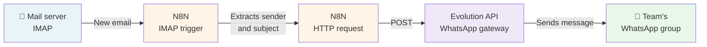

In many organisations, email is still the main channel for external communication, but teams increasingly coordinate over instant messaging. That gap creates a real problem: important messages land in the inbox without anyone noticing in time.

This is the case we solved for a worker cooperative: **automatically posting a WhatsApp alert every time an email arrives at a corporate account**, without relying on paid third-party services, without keeping any computer permanently on, and with full control over the data.

---

## The problem

The cooperative handled external communications through a corporate email account. Day-to-day, though, the team coordinated over WhatsApp. The result was predictable: emails going unnoticed, late replies, and someone having to manually check the inbox on a regular basis.

The solution had to meet a few requirements:

- Run continuously, without depending on anyone having a device switched on
- Never send sensitive data to third-party services
- Have a low, predictable cost
- Be maintainable by people with basic technical knowledge

---

## The solution: self-hosted automation

We went with a fully self-hosted architecture on a cloud VPS, combining three open source tools:

### N8N — the automation engine

[N8N](https://n8n.io) is a workflow automation platform with a visual interface, similar to Zapier or Make, but one you can install on your own server. It lets you connect hundreds of services and define custom logic without writing code.

Here, N8N monitors the mail account over IMAP and, when it detects a new message, extracts the sender and subject to pass on to the next step.

### Evolution API — the WhatsApp gateway

[Evolution API](https://github.com/EvolutionAPI/evolution-api) is an open source REST API for sending and receiving WhatsApp messages using the Baileys library (the same technical foundation as WhatsApp Web). You connect it by scanning a QR code from a real phone, exactly like WhatsApp Web, and it exposes HTTP endpoints for sending messages to individual contacts or groups.

This piece is the key to the whole solution: it lets N8N send WhatsApp messages with a simple HTTP call, with no need for Meta's official API, which requires business approval and comes with variable costs.

### Hetzner Cloud — infrastructure

Both services run on an entry-level [Hetzner Cloud](https://www.hetzner.com/cloud) VPS (CPX12, 2 vCPU, 2 GB RAM, ~€12/month), which is plenty for this workload. Everything is orchestrated with Docker Compose, which simplifies both deployment and maintenance.

---

## The architecture

The message the group receives follows this format:

> 📧 New email from: [sender]
> ✉️ Subject: [message subject]

---

## The N8N workflow

The workflow has just two nodes:

**1. Email Trigger (IMAP)**
Connects to the mail server over IMAP with SSL. Every time a new email arrives, it extracts the `from` and `subject` fields and triggers the flow.

**2. HTTP Request**
Makes a POST call to the Evolution API with the configured credentials, sending the message to the WhatsApp group with the data pulled from the email.

The workflow stays active on the server at all times. N8N manages it as a continuous process, with no manual intervention needed.

---

## Deploying with Docker Compose

The `docker-compose.yml` spins up four containers on an internal network:

- **n8n** — the automation engine (port 5678)
- **evolution-api** — the WhatsApp gateway (port 8080)
- **postgres** — database for Evolution API
- **redis** — cache for Evolution API

Communication between N8N and Evolution API happens inside the Docker network, without exposing unnecessary services to the outside.

---

## Considerations and limitations

**WhatsApp's terms of service.** Evolution API relies on the Baileys library, which is a reverse-engineered implementation of the WhatsApp Web protocol. Meta doesn't officially approve it. For low-volume organisational use like this, the risk is low, but it's worth keeping in mind. The official alternative is the WhatsApp Business API, which comes with higher cost and complexity.

**Number availability.** The phone number linked to Evolution API needs an active session. If WhatsApp logs the session out (which happens occasionally), you have to re-scan the QR code. An alert for this scenario could be automated.

**HTTPS.** For production, the ideal is to put a reverse proxy (Nginx or Caddy) in front of the services with a TLS certificate. Caddy is the most convenient option: it manages Let's Encrypt certificates automatically, with no extra configuration.

---

## Result

The team now gets an instant WhatsApp alert in their group every time an email arrives at the corporate account. The solution has been running continuously on the VPS with no manual intervention, at a fixed monthly cost and with no dependency on third-party services.

Total implementation time, starting from zero, was a few hours — most of it spent connecting and configuring WhatsApp through Evolution API.

---

## Full stack

| Tool | Role | License |
|---|---|---|
| N8N | Workflow automation | Sustainable Use License |
| Evolution API | WhatsApp gateway | Apache 2.0 |
| PostgreSQL | Database | PostgreSQL License |
| Redis | Cache | BSD |
| Docker Compose | Orchestration | Apache 2.0 |
| Hetzner Cloud | Infrastructure | — |

---

*This case shows it's possible to build robust, functional automations with open source tools, full control over the data, and a very contained cost. The key is combining the right pieces, and choosing your own infrastructure over SaaS services when volume and requirements allow it.*
