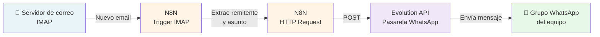

En muchas organizaciones, el correo electrónico sigue siendo el canal principal de comunicación externa, pero los equipos operan cada vez más a través de mensajería instantánea. Esta brecha genera un problema real: mensajes importantes llegan al buzón de entrada sin que nadie se entere a tiempo.

Este es el caso que resolvimos para una cooperativa de trabajo: **automatizar el aviso en WhatsApp cada vez que llega un email a una cuenta corporativa**, sin depender de servicios externos de pago, sin tener ningún ordenador encendido permanentemente, y con control total sobre los datos.

---

## El problema

La cooperativa gestionaba las comunicaciones externas a través de una cuenta de correo corporativa. El equipo, sin embargo, coordinaba su trabajo del día a día por WhatsApp. El resultado era predecible: emails que se perdían, respuestas tardías, y la necesidad de que alguien revisara manualmente el buzón de forma periódica.

La solución tenía que cumplir varios requisitos:

- Funcionar de forma continua, sin depender de que nadie tenga un dispositivo encendido
- No enviar datos sensibles a servicios de terceros
- Tener un coste mínimo y predecible
- Ser mantenible por personas con conocimientos técnicos básicos

---

## La solución: automatización self-hosted

Optamos por una arquitectura completamente autoalojada sobre un VPS en la nube, combinando tres herramientas open source:

### N8N — motor de automatización

[N8N](https://n8n.io) es una plataforma de automatización de flujos de trabajo con interfaz visual, similar a Zapier o Make, pero que puedes instalar en tu propio servidor. Permite conectar cientos de servicios y definir lógica personalizada sin escribir código.

En este caso, N8N se encarga de monitorizar la cuenta de correo por IMAP y, al detectar un nuevo mensaje, extraer el remitente y el asunto para pasarlos al siguiente paso.

### Evolution API — pasarela de WhatsApp

[Evolution API](https://github.com/EvolutionAPI/evolution-api) es una API REST open source que permite enviar y recibir mensajes de WhatsApp utilizando la librería Baileys (la misma base técnica que WhatsApp Web). Se conecta escaneando un código QR desde un teléfono real, igual que WhatsApp Web, y expone endpoints HTTP para enviar mensajes a contactos individuales o grupos.

Esta pieza es la clave de la solución: permite que N8N envíe mensajes a WhatsApp mediante una simple llamada HTTP, sin necesidad de la API oficial de Meta (que requiere aprobación empresarial y tiene costes variables).

### Hetzner Cloud — infraestructura

Ambos servicios corren en un VPS de entrada de [Hetzner Cloud](https://www.hetzner.com/cloud) (CPX12, 2 vCPU, 2 GB RAM, ~12€/mes), suficiente para esta carga de trabajo. Todo se orquesta con Docker Compose, lo que simplifica el despliegue y el mantenimiento.

---

## La arquitectura

El mensaje que recibe el grupo tiene el formato:

> 📧 Hemos recibido un email de: [remitente]  
> ✉️ Asunto: [asunto del mensaje]

---

## El flujo de trabajo en N8N

El workflow tiene únicamente dos nodos:

**1. Email Trigger (IMAP)**  
Se conecta al servidor de correo usando IMAP con SSL. Cada vez que llega un nuevo email, extrae los campos `from` y `subject` y dispara el flujo.

**2. HTTP Request**  
Hace una llamada POST a la API de Evolution con las credenciales configuradas, enviando el mensaje al grupo de WhatsApp con los datos extraídos del email.

El workflow está activo de forma permanente en el servidor. N8N lo gestiona como un proceso continuo, sin necesidad de intervención manual.

---

## Despliegue con Docker Compose

El `docker-compose.yml` levanta cuatro contenedores en una red interna:

- **n8n** — el motor de automatización (puerto 5678)
- **evolution-api** — la pasarela de WhatsApp (puerto 8080)
- **postgres** — base de datos para Evolution API
- **redis** — caché para Evolution API

La comunicación entre N8N y Evolution API se hace dentro de la red Docker, sin exponer servicios innecesarios al exterior.

---

## Consideraciones y limitaciones

**WhatsApp y sus condiciones de uso.** Evolution API utiliza la librería Baileys, que es ingeniería inversa del protocolo de WhatsApp Web. Meta no la aprueba oficialmente. Para un uso organizacional de bajo volumen como este, el riesgo es bajo, pero conviene tenerlo en cuenta. La alternativa oficial es la WhatsApp Business API, con mayor coste y complejidad.

**Disponibilidad del número.** El número de teléfono vinculado a Evolution API debe tener la sesión activa. Si WhatsApp cierra la sesión (algo que ocurre ocasionalmente), hay que volver a escanear el QR. Se puede automatizar un aviso para este caso.

**Sin HTTPS.** En este despliegue inicial, N8N corre sobre HTTP. Para un entorno de producción más robusto, lo recomendable es añadir un proxy inverso (Nginx o Caddy) con certificado TLS.

---

## Resultado

El equipo recibe ahora un aviso inmediato en su grupo de WhatsApp cada vez que llega un email a la cuenta corporativa. La solución lleva funcionando de forma continua en el VPS sin intervención manual, con un coste mensual fijo y sin dependencia de servicios externos.

El tiempo total de implementación, partiendo de cero, fue de unas pocas horas. La mayor parte, conectar y configurar WhatsApp a través de Evolution API.

---

## Stack completo

| Herramienta | Rol | Licencia |
|---|---|---|
| N8N | Automatización de flujos | Sustainable Use License |
| Evolution API | Pasarela WhatsApp | Apache 2.0 |
| PostgreSQL | Base de datos | PostgreSQL License |
| Redis | Caché | BSD |
| Docker Compose | Orquestación | Apache 2.0 |
| Hetzner Cloud | Infraestructura | — |

---

*Este caso de uso demuestra que es posible construir automatizaciones robustas y funcionales con herramientas open source, control total sobre los datos y un coste muy contenido. La clave está en combinar las piezas adecuadas y en elegir infraestructura propia frente a servicios SaaS cuando el volumen y los requisitos lo permiten.*
